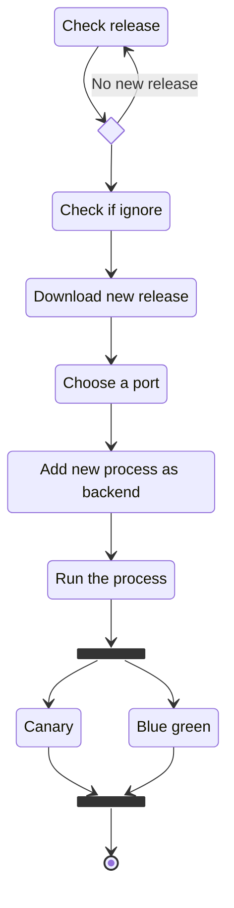
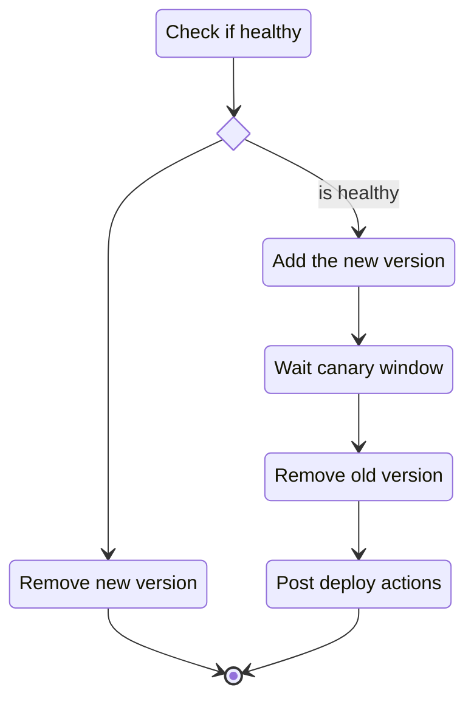
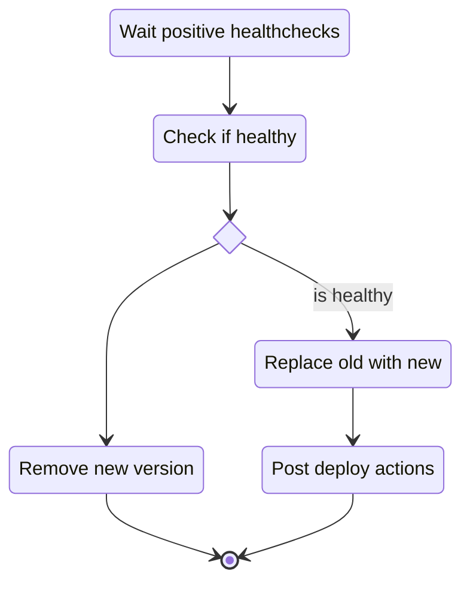
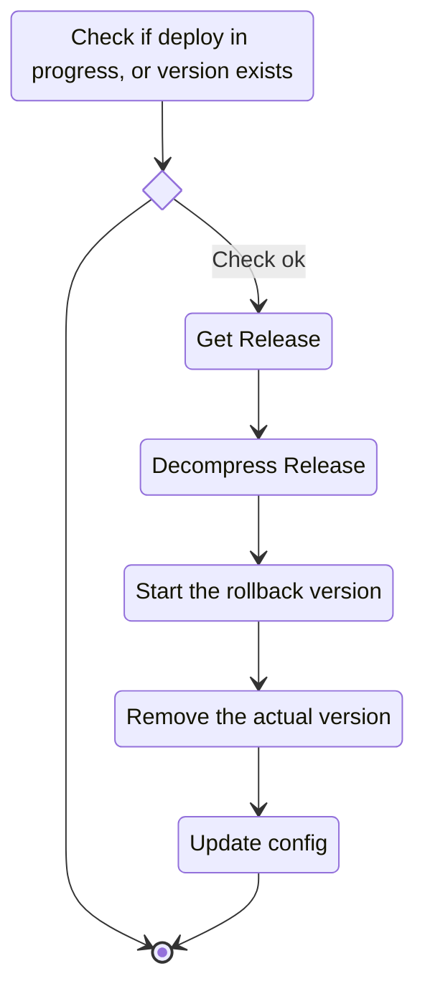
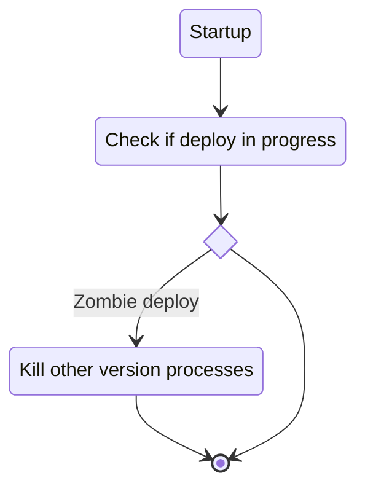

# Interstellar

Application deployer

## Features

- monitor and get release from github
- run executable
- blue green and canary deploy
- rollback
- recovery from crash
- cli

## Install and requirements

- Deps: `gh` (github cli)

## CLI

```bash
interstellar -h
```

### Dev

```bash
go run main.go -h
```

## Diagrams

### New release Check



### Canary deploy



### Blue green deploy



### Rollback



### Recovery from crash



**NOTE** The healthcheck will remove the backend from the backends list

## LICENSE

[License](LICENSE)
