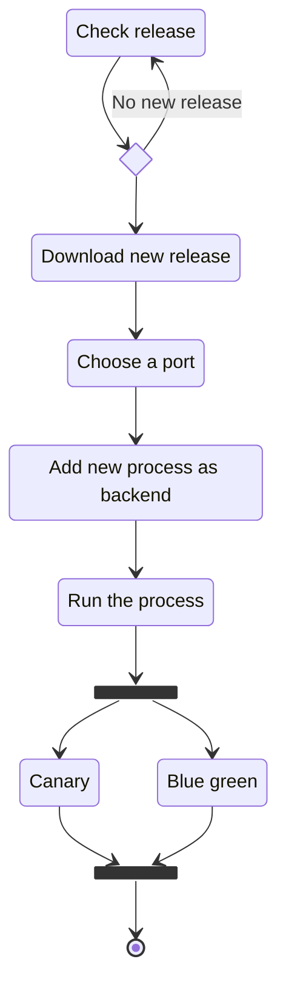

# Interstellar

## Features

- monitor and get release from github
- run executable

## Install and requirements

- Deps: `gh` (github cli)

## Diagrams

### New release Check

### Canary deploy

TODO

### Blue green deploy

TODO