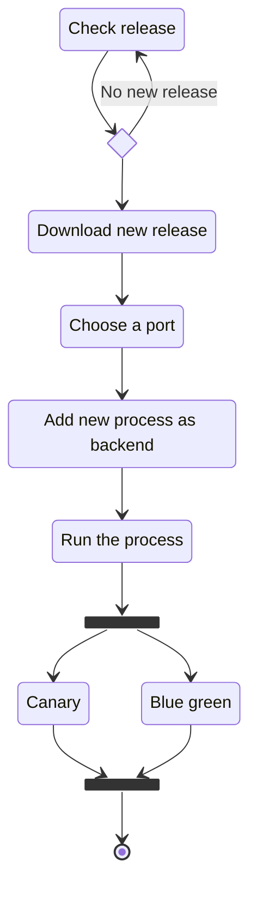
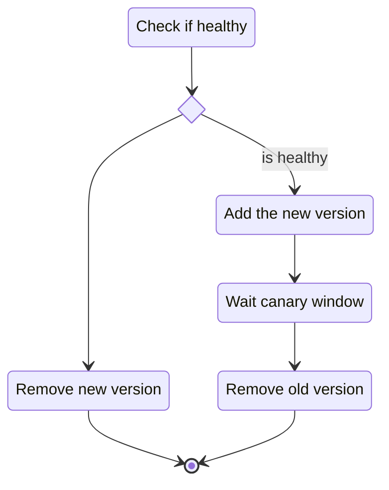
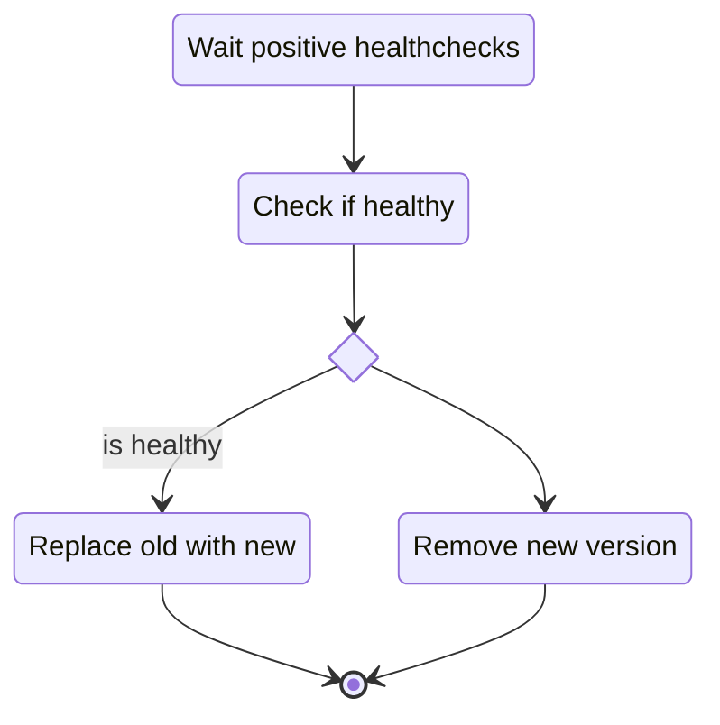

# Interstellar

Application deployer

## Features

- monitor and get release from github
- run executable
- blue green and canary deploy
- cli

## Install and requirements

- Deps: `gh` (github cli)

## Diagrams

### New release Check

### Canary deploy

### Blue green deploy

## LICENSE

[License](LICENSE)
